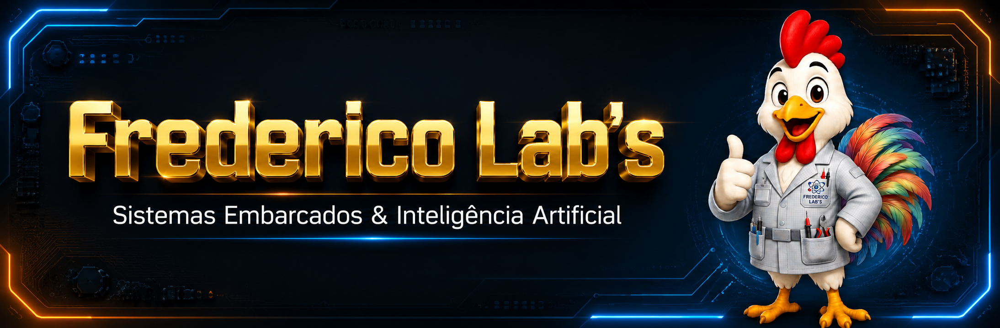

# 01-Frederico-Labs 🚀

  

## Olá, eu sou o Edward! 👋

🧠 **Entusiasta de Sistemas Embarcados, Automação e IA Aplicada ao Hardware**

Meu GitHub é o reflexo da minha bancada: um laboratório vivo onde protótipos saem do papel, microcontroladores ganham voz e Inteligências Artificiais deixam de ser apenas teoria para se tornarem parte ativa de soluções reais do mundo físico.

---

## 🛠️ Tecnologias & Hardwares de Domínio

Aqui você encontrará projetos desenvolvidos utilizando as seguintes ferramentas:

- **Microcontroladores:** ESP32, ESP8266, Arduino (Uno/Nano/Mega), STM32.
- **Inteligência Artificial na Borda (TinyML):** Modelos de visão computacional e análise de dados otimizados para rodar direto no hardware.
- **Protocolos de Comunicação:** MQTT, I2C, SPI, UART, HTTP/REST.
- **Sensores e Atuadores:** Integração de sensores industriais, relés, displays e atuadores de automação.
- **Linguagens de Programação:** C/C++, Python (MicroPython/CircuitPython).

---

## 📁 Organização do Laboratório

- `firmware/`: Códigos e algoritmos desenvolvidos para os microcontroladores.
- `hardware/`: Diagramas elétricos, pinouts e esquemáticos dos circuitos.
- `docs/`: Documentações auxiliares e notas de desenvolvimento.

---

## 🤝 Contato e Conexões

Se você se interessa por automação inteligente, Internet das Coisas (IoT) ou quer trocar uma ideia sobre hardware, sinta-se à vontade para se conectar comigo!

---

  <i>"Transformando linhas de código em ações no mundo real."</i>

